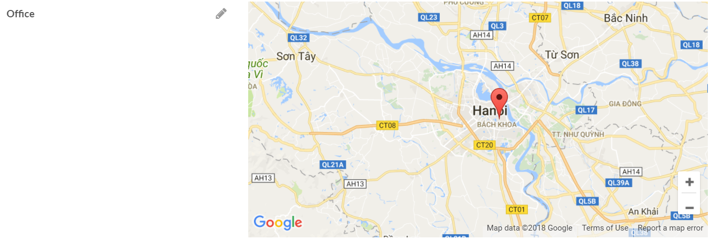
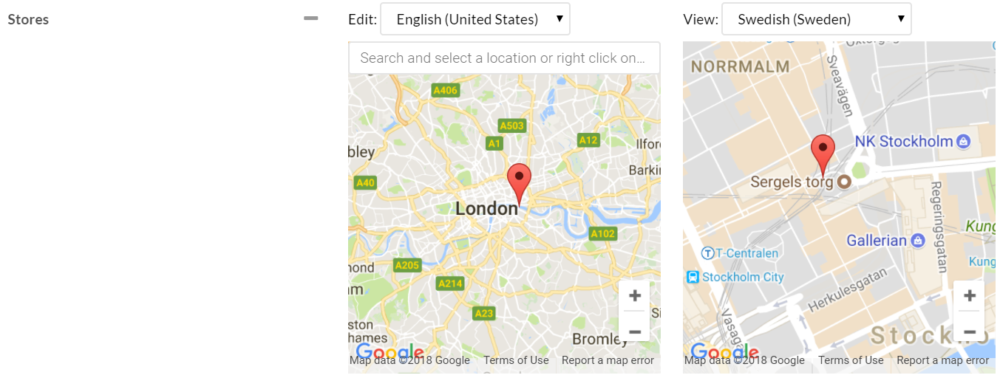
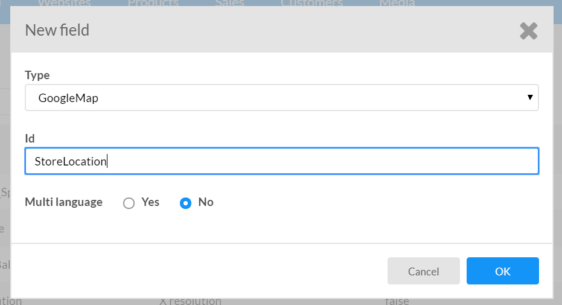
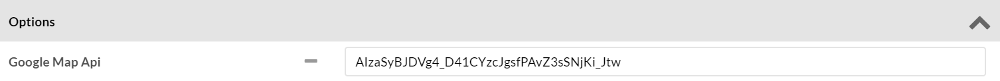
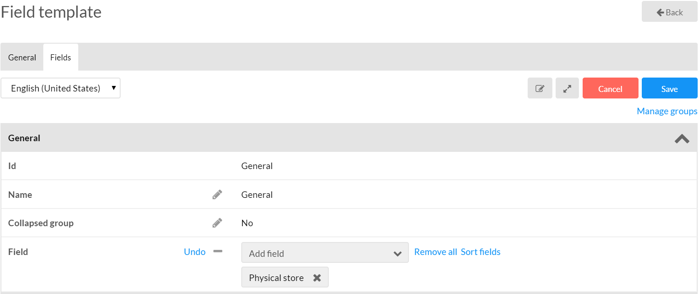
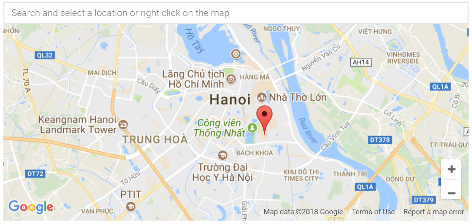

# Litium Field types bag

## Install
To install this Add-on to your site, you need a site running equivalent version of Litium. This Add-on's version is inlined with Litium's version. If its version is 6.0.0, that means it is built against Litium 6.0.0. 

Add this project to your existing Litium solution.

## How to use
Just like other field type:
1. Create a field with type GoogleMap 
2. Edit the field to enter the Google Map Api key. Here is how to get the key: https://developers.google.com/maps/documentation/javascript/get-api-key

3. Add it to the template 
4. Then the Google Map component will be added to the entity page. 

## Build from source
Even though the AddOn is ready to use by just installing the package, you can still build it from source.
### Requirement
1. Make sure you have set up Litium NuGet feed https://docs.litium.com/download/litium-nuget-feed
2. You need a site running equivalent version of Litium. This Add-on's version is inlined with Litium's version. If its version is 6.0.0, that means it is built against Litium 6.0.0.
3. You need to have NPM installed. [How to install NPM](https://www.npmjs.com/get-npm)

### Build
1. Open the project file TonNguyen.FieldTypeBag.csproj
2. Execute the following command in Package Manager Console: `Update-Package -ReInstall`
3. Execute the BuildClientScripts.bat file
4. Build the solution
5. Execute `yarn run pack` to build the NuGet package.